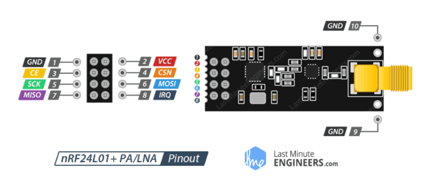
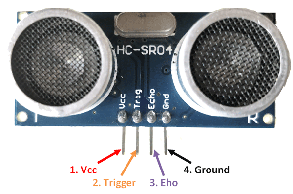
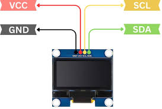

# V2V Communication with CAN Protocol Wirelessly

---

## System Overview

This project simulates Vehicle-to-Vehicle (V2V) communication using two STM32F407 Discovery boards.  
Board 1 (TX) reads sensor data and transmits wirelessly. Board 2 (RX) receives and displays it on an OLED.

```
[Vehicle A]                          [Vehicle B]
HC-SR04   ─┐                         ┌─ OLED Display
MPU-6050  ─┼─► STM32 ─► NRF24 ~~~► NRF24 ─► STM32 ─┤
Button    ─┘                         └─ Serial Monitor
```

---

## Hardware Pinouts

### STM32F407G-DISC1


> PA5, PA6, PA7 = SPI1. PB6, PB7 = I2C1. PB0, PB1 = GPIO for NRF24 CE/CSN.

---

### NRF24L01+ Wireless Module


> ⚠️ VCC = 3.3V only. Place 100µF capacitor across VCC–GND at the module pins.

---

### HC-SR04 Ultrasonic Sensor


> ⚠️ ECHO pin outputs 5V — use a voltage divider (1kΩ + 2kΩ) before connecting to STM32 PA1.

---

### MPU-6050 IMU (GY-521)


> I2C address = 0x68 (AD0 tied to GND). Connect SDA→PB7, SCL→PB6.

---

### SSD1306 OLED (Board 2 only)


> Use the 4-pin I2C version only. I2C address = 0x3C. Shares PB6/PB7 with MPU-6050 (different board).

---

## Voltage Divider for HC-SR04 ECHO Pin

```
ECHO pin (5V)
     |
    1kΩ
     |
     ├──────► PA1 (STM32 input, reads ~3.3V)
     |
    2kΩ
     |
    GND
```

V_out = 5V × (2kΩ / 3kΩ) = **3.33V** ✅

---

## Pin Configuration — Board 1 TX (Vehicle A)

### NRF24L01 → STM32F407
| NRF24L01 Pin | STM32 Pin | Notes |
|---|---|---|
| VCC | 3.3V | 3.3V only, add 100µF cap |
| GND | GND | |
| CE | PB0 | GPIO Output |
| CSN | PB1 | GPIO Output |
| SCK | PA5 | SPI1_SCK |
| MOSI | PA7 | SPI1_MOSI |
| MISO | PA6 | SPI1_MISO |
| IRQ | Not connected | Optional |

### HC-SR04 → STM32F407
| HC-SR04 Pin | STM32 Pin | Notes |
|---|---|---|
| VCC | 5V | |
| GND | GND | |
| TRIG | PA0 | GPIO Output |
| ECHO | PA1 | Via 1kΩ+2kΩ voltage divider |

### MPU-6050 → STM32F407
| MPU-6050 Pin | STM32 Pin | Notes |
|---|---|---|
| VCC | 3.3V | |
| GND | GND | |
| SCL | PB6 | I2C1_SCL |
| SDA | PB7 | I2C1_SDA |
| AD0 | GND | I2C address = 0x68 |

### Push Button → STM32F407
| Button | STM32 Pin | Notes |
|---|---|---|
| Pin 1 | PC0 | GPIO Input, internal pull-up |
| Pin 2 | GND | |

---

## Pin Configuration — Board 2 RX (Vehicle B)

### NRF24L01 → STM32F407
| NRF24L01 Pin | STM32 Pin | Notes |
|---|---|---|
| VCC | 3.3V | 3.3V only, add 100µF cap |
| GND | GND | |
| CE | PB0 | GPIO Output |
| CSN | PB1 | GPIO Output |
| SCK | PA5 | SPI1_SCK |
| MOSI | PA7 | SPI1_MOSI |
| MISO | PA6 | SPI1_MISO |

### SSD1306 OLED → STM32F407
| OLED Pin | STM32 Pin | Notes |
|---|---|---|
| VCC | 3.3V | |
| GND | GND | |
| SCL | PB6 | I2C1_SCL |
| SDA | PB7 | I2C1_SDA |

---

## Libraries Required

| Library | Purpose | Source |
|---|---|---|
| NRF24L01 HAL driver | SPI wireless TX/RX | [controllerstech/NRF24L01](https://github.com/controllerstech/NRF24L01) |
| MPU6050 HAL driver | I2C accel/gyro read | [controllerstech/MPU6050](https://github.com/controllerstech/MPU6050) |
| SSD1306 OLED driver | I2C OLED display | [afiskon/stm32-ssd1306](https://github.com/afiskon/stm32-ssd1306) |

**How to add:**
1. Download `.c` and `.h` files from the links above
2. Copy `.c` files → `Core/Src/`
3. Copy `.h` files → `Core/Inc/`
4. Build — CubeIDE picks them up automatically

---

## STM32CubeMX Setup

### Board 1 (TX)
| Peripheral | Config |
|---|---|
| SPI1 | Full Duplex Master, 8-bit, CPOL=0, CPHA=0 |
| I2C1 | Fast mode, 400kHz |
| PA0 | GPIO Output (TRIG) |
| PA1 | GPIO Input (ECHO) |
| PB0 | GPIO Output (NRF CE) |
| PB1 | GPIO Output (NRF CSN) |
| PC0 | GPIO Input, Pull-up (Button) |
| TIM2 | Microsecond delay for HC-SR04 |
| USART2 | 115200 baud (debug serial) |

### Board 2 (RX)
| Peripheral | Config |
|---|---|
| SPI1 | Full Duplex Master, 8-bit, CPOL=0, CPHA=0 |
| I2C1 | Fast mode, 400kHz |
| PB0 | GPIO Output (NRF CE) |
| PB1 | GPIO Output (NRF CSN) |
| USART2 | 115200 baud (debug serial) |

---

## Step 1 — NRF24L01 Basic Wireless Test

```c
// Board 1 TX — sends a test string every 500ms
// Board 2 RX — receives and prints to serial monitor
// Purpose: verify NRF24L01 wiring and SPI before adding sensors

#include "main.h"
#include "nrf24l01.h"
#include <string.h>

int main(void) {
    HAL_Init();
    SystemClock_Config();
    MX_GPIO_Init();
    MX_SPI1_Init();

    NRF24_Init();
    NRF24_TxMode(0xB3B4B5B6F1, 76);  // address, channel

    char msg[] = "V2V_OK";

    while (1) {
        NRF24_Transmit((uint8_t*)msg, sizeof(msg));
        HAL_Delay(500);
    }
}
```

```c
// Board 2 RX — receives and prints
#include "main.h"
#include "nrf24l01.h"
#include <stdio.h>

int main(void) {
    HAL_Init();
    SystemClock_Config();
    MX_GPIO_Init();
    MX_SPI1_Init();
    MX_USART2_UART_Init();

    NRF24_Init();
    NRF24_RxMode(0xB3B4B5B6F1, 76);  // same address + channel

    char buf[32];

    while (1) {
        if (NRF24_IsDataAvailable(1)) {
            NRF24_Receive((uint8_t*)buf, sizeof(buf));
            // Print received string via USART2 serial monitor
            HAL_UART_Transmit(&huart2, (uint8_t*)buf, strlen(buf), 100);
        }
        HAL_Delay(10);
    }
}
```

**What does the code do — NRF24L01 Basic Test**
> Board 1 transmits the string `"V2V_OK"` every 500ms over 2.4GHz. Board 2 listens on the same address and channel, receives the packet, and prints it to the serial monitor.

**Expected outcome**
> Serial monitor on Board 2 continuously prints `V2V_OK` every ~500ms. This confirms NRF24L01 SPI wiring is correct on both boards, the address and channel match, and the 100µF capacitors are stabilising the module power supply.

**Pin Configuration**
| Signal | STM32 Pin |
|---|---|
| NRF24 CE | PB0 |
| NRF24 CSN | PB1 |
| NRF24 SCK | PA5 |
| NRF24 MOSI | PA7 |
| NRF24 MISO | PA6 |

---

## Step 2 — HC-SR04 Distance Reading

```c
// Board 1 only — reads distance from HC-SR04 and prints to serial monitor
// Verify before adding to the wireless packet

#include "main.h"
#include <stdio.h>

// DWT microsecond delay init
void DWT_Init(void) {
    CoreDebug->DEMCR |= CoreDebug_DEMCR_TRCENA_Msk;
    DWT->CYCCNT = 0;
    DWT->CTRL  |= DWT_CTRL_CYCCNTENA_Msk;
}

void DWT_Delay_us(uint32_t us) {
    uint32_t start = DWT->CYCCNT;
    uint32_t ticks = us * (SystemCoreClock / 1000000);
    while ((DWT->CYCCNT - start) < ticks);
}

float HC_SR04_GetDistance(void) {
    // Send 10µs trigger pulse on PA0
    HAL_GPIO_WritePin(GPIOA, GPIO_PIN_0, GPIO_PIN_SET);
    DWT_Delay_us(10);
    HAL_GPIO_WritePin(GPIOA, GPIO_PIN_0, GPIO_PIN_RESET);

    // Wait for echo HIGH on PA1
    uint32_t start = DWT->CYCCNT;
    while (!HAL_GPIO_ReadPin(GPIOA, GPIO_PIN_1)) {
        if ((DWT->CYCCNT - start) > 168000) return -1.0f;
    }

    uint32_t t1 = DWT->CYCCNT;
    while (HAL_GPIO_ReadPin(GPIOA, GPIO_PIN_1)) {
        if ((DWT->CYCCNT - t1) > 1680000) return -1.0f;
    }
    uint32_t t2 = DWT->CYCCNT;

    float duration_us = (t2 - t1) / 168.0f;
    return (duration_us * 0.0343f) / 2.0f;
}

int main(void) {
    HAL_Init();
    SystemClock_Config();
    MX_GPIO_Init();
    MX_USART2_UART_Init();
    DWT_Init();

    char buf[64];

    while (1) {
        float dist = HC_SR04_GetDistance();
        snprintf(buf, sizeof(buf), "Distance: %.2f m\r\n", dist);
        HAL_UART_Transmit(&huart2, (uint8_t*)buf, strlen(buf), 100);
        HAL_Delay(200);
    }
}
```

**What does the code do — HC-SR04 Distance Test**
> Sends a 10µs trigger pulse on PA0, measures the echo pulse duration on PA1, and converts it to distance in metres using the speed of sound. Prints the result to serial monitor every 200ms.

**Expected outcome**
> Serial monitor prints live distance readings in metres. Moving a hand in front of the sensor changes the value in real time. A reading of `-1.00` means timeout — object too far or wiring issue.

**Pin Configuration**
| Signal | STM32 Pin | Notes |
|---|---|---|
| TRIG | PA0 | GPIO Output |
| ECHO | PA1 | GPIO Input — via 1kΩ+2kΩ voltage divider |
| VCC | 5V | |
| GND | GND | |

---

## Step 3 — MPU-6050 Acceleration Reading

```c
// Board 1 only — reads acceleration magnitude from MPU-6050 via I2C
// Verify before adding to the wireless packet

#include "main.h"
#include "mpu6050.h"
#include <math.h>
#include <stdio.h>

int main(void) {
    HAL_Init();
    SystemClock_Config();
    MX_GPIO_Init();
    MX_I2C1_Init();
    MX_USART2_UART_Init();

    MPU6050_Init(&hi2c1);

    MPU6050_t mpu;
    char buf[64];

    while (1) {
        MPU6050_Read_Accel(&hi2c1, &mpu);

        float accel_g = sqrtf(mpu.Ax * mpu.Ax +
                              mpu.Ay * mpu.Ay +
                              mpu.Az * mpu.Az);

        snprintf(buf, sizeof(buf),
            "Ax:%.2f  Ay:%.2f  Az:%.2f  |  |a|=%.2fg\r\n",
            mpu.Ax, mpu.Ay, mpu.Az, accel_g);

        HAL_UART_Transmit(&huart2, (uint8_t*)buf, strlen(buf), 100);
        HAL_Delay(200);
    }
}
```

**What does the code do — MPU-6050 Acceleration Test**
> Reads raw X, Y, Z acceleration values from the MPU-6050 over I2C and computes the vector magnitude `|a| = sqrt(Ax² + Ay² + Az²)`. Prints all four values to serial monitor every 200ms.

**Expected outcome**
> Serial monitor shows live Ax, Ay, Az values and total acceleration magnitude. At rest flat on a table, `|a|` should read approximately `1.0g` (gravity). Tilting or shaking the board changes the values immediately.

**Pin Configuration**
| Signal | STM32 Pin | Notes |
|---|---|---|
| SCL | PB6 | I2C1_SCL |
| SDA | PB7 | I2C1_SDA |
| VCC | 3.3V | |
| GND | GND | |
| AD0 | GND | I2C address = 0x68 |

---

## Step 4 — OLED Display Test (Board 2)

```c
// Board 2 only — displays static text on SSD1306 OLED
// Verify before connecting to NRF24 receive pipeline

#include "main.h"
#include "ssd1306.h"
#include "ssd1306_fonts.h"

int main(void) {
    HAL_Init();
    SystemClock_Config();
    MX_GPIO_Init();
    MX_I2C1_Init();

    ssd1306_Init();
    ssd1306_Fill(Black);

    ssd1306_SetCursor(0, 0);
    ssd1306_WriteString("V2V System", Font_11x18, White);

    ssd1306_SetCursor(0, 22);
    ssd1306_WriteString("Waiting...", Font_7x10, White);

    ssd1306_SetCursor(0, 40);
    ssd1306_WriteString("Board 2 RX", Font_7x10, White);

    ssd1306_UpdateScreen();

    while (1) {
        HAL_Delay(1000);
    }
}
```

**What does the code do — OLED Display Test**
> Initialises the SSD1306 OLED over I2C, clears the screen, and writes three lines of static text. Confirms I2C wiring and OLED library are working before integrating with the NRF24 receive code.

**Expected outcome**
> OLED displays:
> ```
> V2V System
> Waiting...
> Board 2 RX
> ```
> If screen stays blank — check SDA/SCL wiring, confirm I2C address is 0x3C, verify 3.3V power.

**Pin Configuration**
| Signal | STM32 Pin | Notes |
|---|---|---|
| SCL | PB6 | I2C1_SCL |
| SDA | PB7 | I2C1_SDA |
| VCC | 3.3V | |
| GND | GND | |

---

## Step 5 — Full V2V Demo (Board 1 TX)

```c
// Board 1 TX — reads all sensors, packs into struct, transmits wirelessly

#include "main.h"
#include "nrf24l01.h"
#include "mpu6050.h"
#include <math.h>
#include <string.h>

// Data packet — must match Board 2 exactly
typedef struct {
    float    distance_m;
    float    accel_g;
    uint8_t  brake_alert;
} VehicleData_t;

void DWT_Init(void) {
    CoreDebug->DEMCR |= CoreDebug_DEMCR_TRCENA_Msk;
    DWT->CYCCNT = 0;
    DWT->CTRL  |= DWT_CTRL_CYCCNTENA_Msk;
}

void DWT_Delay_us(uint32_t us) {
    uint32_t start = DWT->CYCCNT;
    uint32_t ticks = us * (SystemCoreClock / 1000000);
    while ((DWT->CYCCNT - start) < ticks);
}

float HC_SR04_GetDistance(void) {
    HAL_GPIO_WritePin(GPIOA, GPIO_PIN_0, GPIO_PIN_SET);
    DWT_Delay_us(10);
    HAL_GPIO_WritePin(GPIOA, GPIO_PIN_0, GPIO_PIN_RESET);

    uint32_t start = DWT->CYCCNT;
    while (!HAL_GPIO_ReadPin(GPIOA, GPIO_PIN_1)) {
        if ((DWT->CYCCNT - start) > 168000) return -1.0f;
    }
    uint32_t t1 = DWT->CYCCNT;
    while (HAL_GPIO_ReadPin(GPIOA, GPIO_PIN_1)) {
        if ((DWT->CYCCNT - t1) > 1680000) return -1.0f;
    }
    uint32_t t2 = DWT->CYCCNT;

    return ((t2 - t1) / 168.0f * 0.0343f) / 2.0f;
}

int main(void) {
    HAL_Init();
    SystemClock_Config();
    MX_GPIO_Init();
    MX_SPI1_Init();
    MX_I2C1_Init();
    DWT_Init();

    NRF24_Init();
    NRF24_TxMode(0xB3B4B5B6F1, 76);

    MPU6050_Init(&hi2c1);

    VehicleData_t data;

    while (1) {
        // 1. Distance
        data.distance_m = HC_SR04_GetDistance();

        // 2. Acceleration magnitude
        MPU6050_t mpu;
        MPU6050_Read_Accel(&hi2c1, &mpu);
        data.accel_g = sqrtf(mpu.Ax*mpu.Ax +
                             mpu.Ay*mpu.Ay +
                             mpu.Az*mpu.Az);

        // 3. Brake button (active LOW — pull-up enabled)
        data.brake_alert = !HAL_GPIO_ReadPin(GPIOC, GPIO_PIN_0);

        // 4. Transmit
        NRF24_Transmit((uint8_t*)&data, sizeof(data));

        HAL_Delay(200);
    }
}
```

**What does the code do — Full TX**
> Reads distance from HC-SR04, acceleration magnitude from MPU-6050, and brake status from the push button. Packs all three into a `VehicleData_t` struct and transmits it wirelessly every 200ms over NRF24L01.

**Expected outcome**
> Board 1 continuously transmits a 9-byte struct at 5Hz. No output visible on Board 1 itself — verify by checking Board 2 OLED in Step 6.

**Pin Configuration**
| Signal | GPIO | Notes |
|---|---|---|
| NRF24 CE | PB0 | |
| NRF24 CSN | PB1 | |
| NRF24 SCK | PA5 | SPI1 |
| NRF24 MOSI | PA7 | SPI1 |
| NRF24 MISO | PA6 | SPI1 |
| HC-SR04 TRIG | PA0 | |
| HC-SR04 ECHO | PA1 | Via voltage divider |
| MPU-6050 SCL | PB6 | I2C1 |
| MPU-6050 SDA | PB7 | I2C1 |
| Button | PC0 | Internal pull-up |

---

## Step 6 — Full V2V Demo (Board 2 RX)

```c
// Board 2 RX — receives wireless packet, displays on OLED

#include "main.h"
#include "nrf24l01.h"
#include "ssd1306.h"
#include "ssd1306_fonts.h"
#include <stdio.h>
#include <string.h>

// Data packet — must match Board 1 exactly
typedef struct {
    float    distance_m;
    float    accel_g;
    uint8_t  brake_alert;
} VehicleData_t;

int main(void) {
    HAL_Init();
    SystemClock_Config();
    MX_GPIO_Init();
    MX_SPI1_Init();
    MX_I2C1_Init();

    NRF24_Init();
    NRF24_RxMode(0xB3B4B5B6F1, 76);  // same address + channel as TX

    ssd1306_Init();
    ssd1306_Fill(Black);
    ssd1306_SetCursor(10, 24);
    ssd1306_WriteString("Waiting...", Font_7x10, White);
    ssd1306_UpdateScreen();

    VehicleData_t rx;
    char buf[32];

    while (1) {
        if (NRF24_IsDataAvailable(1)) {
            NRF24_Receive((uint8_t*)&rx, sizeof(rx));

            ssd1306_Fill(Black);

            // Line 1 — Distance
            snprintf(buf, sizeof(buf), "Dist: %.1fm", rx.distance_m);
            ssd1306_SetCursor(0, 0);
            ssd1306_WriteString(buf, Font_7x10, White);

            // Line 2 — Acceleration
            snprintf(buf, sizeof(buf), "Accel: %.2fg", rx.accel_g);
            ssd1306_SetCursor(0, 16);
            ssd1306_WriteString(buf, Font_7x10, White);

            // Line 3 — Brake alert
            ssd1306_SetCursor(0, 32);
            if (rx.brake_alert) {
                ssd1306_WriteString("!! BRAKE ALERT !!", Font_7x10, White);
            } else {
                ssd1306_WriteString("Status: OK", Font_7x10, White);
            }

            ssd1306_UpdateScreen();
        }
        HAL_Delay(10);
    }
}
```

**What does the code do — Full RX**
> Listens on the NRF24L01 for incoming packets. When a packet arrives, it unpacks the `VehicleData_t` struct and updates the OLED display with distance, acceleration, and brake alert status.

**Expected outcome**
> OLED on Board 2 shows live data from Board 1:
> ```
> Dist: 0.24m
> Accel: 1.02g
> Status: OK
> ```
> Press the button on Board 1 — OLED immediately shows `!! BRAKE ALERT !!`.  
> Move hand in front of HC-SR04 — distance value changes live.  
> Data refreshes every ~200ms.

**Pin Configuration**
| Signal | GPIO | Notes |
|---|---|---|
| NRF24 CE | PB0 | |
| NRF24 CSN | PB1 | |
| NRF24 SCK | PA5 | SPI1 |
| NRF24 MOSI | PA7 | SPI1 |
| NRF24 MISO | PA6 | SPI1 |
| OLED SCL | PB6 | I2C1 |
| OLED SDA | PB7 | I2C1 |

---

## Build Order (follow this, do not skip steps)

- [ ] Step 1 — NRF24L01 basic string TX/RX — confirm wireless works
- [ ] Step 2 — HC-SR04 distance reading — confirm sensor + voltage divider
- [ ] Step 3 — MPU-6050 accel reading — confirm I2C
- [ ] Step 4 — OLED display test — confirm display on Board 2
- [ ] Step 5 + 6 — Combine everything — full struct TX/RX with OLED

---

## Phase 2 — RC Car Extension

> To be implemented after Phase 1 demo is stable.

- Mount Board 1 + sensors on RC car chassis
- Mount Board 2 + OLED on second car or fixed base station
- Add motor driver (DRV8833 or L298N) for actual movement
- Add encoder wheels for real speed measurement
- Auto brake trigger when distance < threshold

---

## References

- [STM32F407 Reference Manual](https://www.st.com/resource/en/reference_manual/rm0090-stm32f405415-stm32f407417-stm32f427437-and-stm32f429439-advanced-armbased-32bit-mcus-stmicroelectronics.pdf)
- [NRF24L01+ Datasheet](https://www.sparkfun.com/datasheets/Components/SMD/nRF24L01Pluss_Preliminary_Product_Specification_v1_0.pdf)
- [MPU-6050 Datasheet](https://invensense.tdk.com/wp-content/uploads/2015/02/MPU-6000-Datasheet1.pdf)
- [SSD1306 Datasheet](https://cdn-shop.adafruit.com/datasheets/SSD1306.pdf)
- [NRF24L01 HAL Library](https://github.com/controllerstech/NRF24L01)
- [MPU6050 HAL Library](https://github.com/controllerstech/MPU6050)
- [SSD1306 OLED Library](https://github.com/afiskon/stm32-ssd1306)
